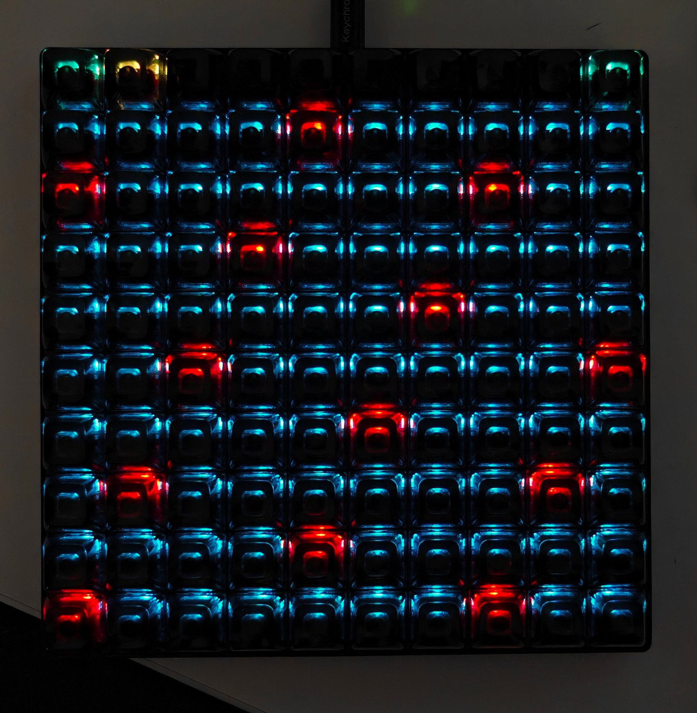

# Keypad (Keychron C100 MIDI Pad)

[](https://github.com/roguefort-dev/Keypad-keychron-c100-midi-pad/actions/workflows/build_binaries.yaml)

USB MIDI firmware for the **Keychron C100 8K** giant macro pad, built on
Keychron's QMK fork. The default layer is an isomorphic **E natural minor** MIDI
controller with selectable roots and scales, octave controls, and responsive
per-key RGB.



## Scale performance layer

The top-left two keys shift the playable range down or up by one octave. The
fourth and fifth keys switch directly to Scale or Chord mode, and the top-right
key momentarily opens Settings. This row is identical in both performance
modes.

| Oct − | Oct + |  | Scale | Chord |  |  |  |  | Hold Settings |
|---|---|---|---|---|---|---|---|---|---|

The remaining 90 keys send notes from the selected scale. The lowest note is at
the bottom-left. Moving right advances one scale degree; moving up advances
three degrees. The overlap keeps interval and chord shapes consistent and
deliberately places duplicate notes around the grid.

- Default root and scale: E natural minor (`E F♯ G A B C D`)
- Base note: E2 (MIDI note 40)
- Fixed velocity: 100
- Fixed channel: 1
- Octave range: −2 to +2

At rest, the playable grid uses only two palette colors: ordinary pads at
brightness 180 and root notes at brightness 225. Pressing a note changes
every pad that represents that exact MIDI note—including its duplicates—to the
palette's pressed color at brightness 255. Releasing the final duplicate restores
the two-color resting state.

## Chord performance layer

Chord mode keeps the same top row as Scale mode. Its rightmost 7×3 block plays
the first seven notes of the selected scale across three octaves. The lowest
and most accessible row begins with the simplest major chord; complexity grows
to the right within each family and upward across the board:

| Family | Left-to-right presets |
|---|---|
| Advanced / jazz | Quartal, AugΔ7, Maj7♯11, MinΔ9, 13♭9, 13♯11, 7alt |
| Diminished / altered | Dim, Dim7, ø7, Aug, 7♭5, 7♯5, DimΔ7 |
| Dominant | Dom7, Dom9, Dom11, Dom13, 7♭9, 7♯9, 7♯11 |
| Minor | Min, Min6, Min7, Min9, Min11, Min13, MinΔ7 |
| Major | Maj, Maj6, Maj7, Maj9, Maj11, Maj13, Maj13♯11 |

The two rows above the presets toggle scale-relative chord degrees 1–14. The
default custom chord is `1·3·5`. Choosing a degree while an idle preset is
selected starts a fresh custom chord containing only degree 1 and the chosen
degree; degree 1 can then be removed for rootless voicings. While either the
preset key itself or one of its playable root notes is held, degree buttons
instead preserve the preset's fixed tones and queue scale-relative extensions
in press order above its current highest tone (for example, Maj7 + degree 2
becomes Maj7(add9)). This also works before a root note is played. Active custom
chords use the same above-highest behavior, and the MIDI chord is re-voiced
immediately.

Fixed presets keep their literal chromatic intervals even when a chord contains
notes outside the selected scale. For example, the Maj preset on E always sends
`E–G♯–B`, including G♯ while E natural minor is selected.

The controls occupy two left-aligned rows. The upper row groups `AUTO`, `LATCH`,
and `QNT`; the row below contains `INV`, `BASS`, `DROP`, `OPEN`, and `STR`:

- `INV`, `BASS`, `DROP`, `OPEN`, and `STR` advance on release. Holding one for one
  second resets it. Looping or resetting flashes its key and display glyph
  three times with alternating 50 ms phases.
- `BASS` cycles Off → root at −1 octave → root at −2 octaves → Off. It adds a
  low root voice without moving the selected root pad or the rest of the chord.
- `DROP` cycles off, drop 2, drop 3, and drop 2+4 where the chord has enough
  tones. `OPEN` provides three progressively wider voicings.
- `STR` cycles off, 20/40/60 ms upward strums, then 20/40/60 ms downward
  strums. Delayed note-ons are queued without blocking keyboard scanning.
- `AUTO` pairs voices low-to-high and chooses the inversion with the least
  octave-aware motion from the previously played chord. The root pad's octave
  remains a hard register anchor; Auto never silently shifts the whole voicing
  to another octave. `LATCH` holds a chord after release and replaces it when
  the next root is played.
- `QNT` cycles Off → nearest note with upward tie-break → nearest note with
  downward tie-break → Off. Distance always wins; direction matters only when
  the two neighboring scale notes are equally close. With QNT off, an
  out-of-scale tone remains chromatic and lights its nearest scale-position LED
  in the theme's Quaternary color (both neighbors light on an exact tie).
  Quantized tones use the ordinary in-scale chord-tone color.

Control changes temporarily replace the 7×3 root grid with a bottom-aligned
3×5 glyph (`I`, `B`, `D`, `A`, `O`, `S`, `L`, or `Q`). Multi-level controls use the six
pixels above the glyph as a counter; color laps extend the counter beyond six.
The stepped voicing controls use a separate rainbow palette. Enabled `AUTO`,
`LATCH`, and `QNT` use the theme's Secondary color at the normal brightness of
180, so they remain distinct from a 255-brightness physical press. All resting,
selected, root, pressed, and chord-tone LEDs use the currently selected
five-color theme. Idle presets use Tertiary at brightness 180; selected
presets and degrees use Quinary at brightness 225.

## Settings

Hold the top-right Settings key to open this 10×10 layout:

- The top-left two keys select the previous or next color palette. The new
  palette applies immediately, and its name scrolls through one complete pass
  before the previous root/scale display returns.
- The two scale rows contain 18 selections per page. Their rightmost keys move
  to the previous or next page and briefly show a 3×6 pixel arrow.
- The lower-left 6×2 block selects the root: `C/C♯`, `D/D♯`, `E/F`, `F♯/G`,
  `G♯/A`, and `A♯/B`.
- A blank column separates the root selector from a 7×6 character display.
- Root notes appear as a 3×6 TomTentacles glyph. Sharps add a cyan 2×2 marker
  after a one-column gutter.
- Scale names start left-aligned, hold for 400 ms, and then scroll. Selecting a
  different scale always restarts the text from the first character.
- Page arrows use the same 3×6 size and left alignment as the font, and remain
  visible for 250 ms or until another control is pressed.

The first page contains:

| Major | Minor | Harmonic | Melodic | Dorian | Phrygian | Lydian | Mixolydian | Locrian |
|---|---|---|---|---|---|---|---|---|
| Major pent | Minor pent | Blues | Whole tone | Chromatic | Half-whole dim | Whole-half dim | Bebop major | Bebop dominant |

The second page currently contains Hungarian minor and Japanese pentatonic,
leaving room for sixteen more scales without another layout change.

## Color palettes

Each palette is five ordered source colors rather than five rigid UI roles.
Individual views compose them consistently: Scale mode uses Primary for idle
notes, Tertiary for roots and the character display, and Secondary for pressed
notes. Quaternary and Quinary provide complementary controls and navigation.
Brightness is applied separately: roots, pressed notes, and Settings accents
use the full 255 level, while ordinary pads are dimmed to preserve hierarchy.

| Palette | Primary | Secondary | Tertiary | Quaternary | Quinary |
|---|---|---|---|---|---|
| Neon | `#002AFF` | `#00FBFF` | `#AE00FF` | `#FF00EA` | `#FF0033` |
| Cyberpunk | `#FF00AE` | `#FF7300` | `#B3FF00` | `#FFD500` | `#FF006F` |
| Terminal | `#00B3FF` | `#FFA200` | `#FF0000` | `#1FFF62` | `#FBFF00` |
| Navy | `#009DFF` | `#FF7300` | `#FFFF00` | `#BE00FF` | `#00FF5A` |
| Matrix | `#00FFCC` | `#B3FF00` | `#FF00C8` | `#FF0000` | `#FF9500` |

The last selected palette, root key, and scale are saved to EEPROM whenever
they change and restored after unplugging or rebooting. A fresh or reset board
starts with Terminal, E, and natural minor.

## Layer navigation

While Settings is held, press the key immediately to its left to enter the
latched layer-select page. Releasing Settings does not take you back. The first
two keys there also select Scale or Chord mode.

Both performance modes use the same direct Scale/Chord switches and momentary
Settings key.

## Build locally

This repository is a QMK external userspace. It expects the Keychron fork on
branch `2025q3`, which contains C100 8K support.

```sh
git clone --branch 2025q3 --recurse-submodules https://github.com/Keychron/qmk_firmware.git
git clone https://github.com/roguefort-dev/Keypad-keychron-c100-midi-pad.git
cd Keypad-keychron-c100-midi-pad
make build QMK_HOME=../qmk_firmware
```

The resulting file is `keychron_c100_8k_midi_pad.bin` in this repository's
root. GitHub Actions also builds the firmware after each push and publishes the
binary through the repository workflow.

The current build uses 67,062 bytes of the target's verified 128 KiB flash
region (about 50%).

## Test MIDI after flashing

After the pad reconnects, confirm that the operating system exposes a USB MIDI
input. Open a MIDI monitor or DAW and verify that note presses produce matching
note-on and note-off messages. Changing the root, scale, octave, or active layer
releases all tracked notes first to prevent stuck notes.

## Flashing and recovery

Flashing firmware can make the pad temporarily unusable if the wrong image is
selected. Keep Keychron's stock C100 8K v1.0.1 firmware available. Its verified
SHA-256 is:

```text
2f95264cc589bbe8c7e2612fb950503e75464409e64874159ca4da6da845ebc1
```

Enter the bootloader by holding the top-left key while connecting USB, or use
the physical reset button under the spacebar position. Flash only a binary
built for `keychron/c100_8k`.

## License

GPL-2.0-or-later, matching QMK Firmware. See [LICENSE](LICENSE) and
[THIRD_PARTY_NOTICES.md](THIRD_PARTY_NOTICES.md).
